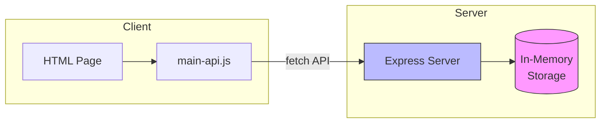
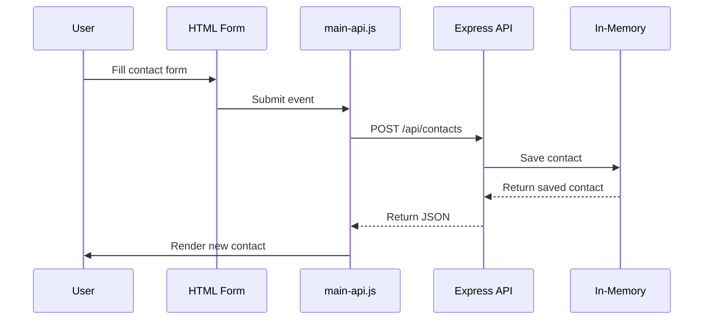

# Contact List API Guide

## Overview

This guide explains how to replace the localStorage-based contact list with a Node.js Express API backend.

## Architecture



## File Structure

```
contact-list/
├── index.html           # Original HTML (unchanged)
├── main.js              # Original localStorage version (unchanged)
├── main-api.js          # NEW: API-based version
├── server.js            # NEW: Express API server
├── style.css            # Original styles
└── API_GUIDE.md         # This guide
```

## API Endpoints

| Method | Endpoint | Description |
|--------|----------|-------------|
| GET | `/api/contacts` | Get all contacts |
| POST | `/api/contacts` | Create new contact |
| PUT | `/api/contacts/:id` | Update existing contact |
| DELETE | `/api/contacts/:id` | Delete a contact |

### Request/Response Examples

**GET /api/contacts**
```json
[
  {
    "id": 1,
    "name": "John",
    "lastname": "Doe",
    "sex": "male",
    "phone": "123456789",
    "city": "New York",
    "address": "123 Main St"
  }
]
```

**POST /api/contacts**
```json
{
  "name": "Jane",
  "lastname": "Smith",
  "sex": "female",
  "phone": "987654321",
  "city": "Boston",
  "address": "456 Oak Ave"
}
```

## Setup Instructions

### 1. Install Dependencies

```bash
npm init -y
npm install express cors
```

### 2. Run the Server

```bash
node server.js
```

The server will start at `http://localhost:3000`

### 3. Use the API Version

To use the new API-based version, update `index.html` to load `main-api.js`:

```html
<script src="./main-api.js"></script>
```

Or serve the HTML that uses `main-api.js`.

## Data Flow



## Comparison: LocalStorage vs API

| Aspect | localStorage (main.js) | API (main-api.js) |
|--------|----------------------|-------------------|
| Storage | Browser localStorage | Server memory |
| Persistence | Survives refresh | Resets on server restart |
| Data sharing | Single browser | Multiple clients |
| Network | No | Yes (HTTP) |

## Starting Both Versions

You can run both versions simultaneously:

1. **Original (localStorage)**: Open `index.html` directly in browser
2. **API version**: 
   - Run `node server.js`
   - Open `http://localhost:3000` in browser

## Troubleshooting

- **Port already in use**: Change port in `server.js` or kill the process using port 3000
- **CORS errors**: CORS is enabled in server.js by default
- **Contacts not showing**: Ensure server is running before loading the page